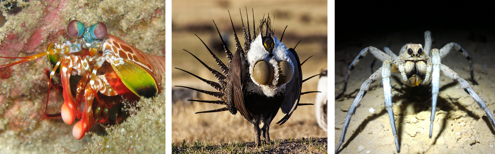

# About me

- Background in B.A./M.Sc. organismal biology/ecology
- Most recently in Santa Barbara
- Next up: Tel Aviv



---

background-image: url(santabarbara.jpg)
background-position: center
background-size: cover

---

background-image: url(https://media.giphy.com/media/wPn31WOCzkvKg/giphy.gif)
background-position: center
background-size: contain

---

# Advent of Code

a series of [programming puzzles](https://adventofcode.com/2017/about) in December every year (2015-present)

- language agnostic
- 2-part puzzles that build on a theme 
- leaderboard/stats

fun topics (recursion, hashing, etc.) but don't showcase R/tidyverse

---

# Tidies of March

A series of bite-sized puzzles that focus on _core data science skills_ as championed by the tidyverse set of packages

**User goals:**

- Practice tidyverse skills
- Improve workflow/project management 
- Engage with the community
- Learn by reading other people's code

---

# Tidyverse functions

What more is there than the core verbs?

- `mutate()`
- `select()`
- `filter()`
- `summarize()`
- `arrange()`
- `group_by()`

---

class: inverse, center, middle

# Under-loved tidyverse functions

---

## Data

```{r}
library(tidyverse)

starwars
```

---

background-image: url(grunions.jpg)
background-position: center
background-size: cover
class: inverse, center, middle

# `count`ing things

---

```{r}
starwars %>%
    group_by(hair_color, skin_color, eye_color) %>% #<<
    summarize(count = n()) #<<
```

---

```{r}
starwars %>% 
    count(hair_color, skin_color, eye_color) #<<
```

---

background-image: url(nest.jpg)
background-position: center
background-size: cover
class: inverse, center, middle

# Embrace the list-column

---

## List-columns in familiar form

```{r echo = FALSE}
sw <- starwars %>% 
    select(name, starships) %>% 
    unnest(starships) %>% 
    group_by(name) %>%
    summarize(starships_combined = paste(starships, collapse = "; "))
sw
```

---

## `separate` out the `rows`

```{r}
sw %>% 
    separate_rows(starships_combined, sep = "; ") #<<
```

---

## `nest()/unnest()`

```{r}
starwars %>% 
    select(name, starships) 
```

---

```{r}
starwars %>% 
    select(name, starships) %>% 
    unnest(starships) #<<
```

---

```{r}
starwars %>% 
    select(name, starships) %>% 
    unnest(starships) %>% 
    nest(name) #<<
```

---

## Typical use-cases

- models - split your data by some group and apply the model onto your tibble list-column
- strings - `str_extract_all` & friends often return results of varying length

---

background-image: url(shakshuka.jpg)
background-position: center
background-size: cover
class: inverse, center, middle

# Data ingest

---

## Handle data ingest issues upfront

```{r eval = FALSE}
read_csv("data.csv", 
         skip = 2,
         na = c("NA", "-9999"),
         trim_ws = TRUE)
```

---

```{r}
pies <- tribble(
    ~name, ~eggs, ~flour,
    "lemon", NA, NA, 
    " pumpkin", 2, 1,
    "chocolate ", 1, "none"
)

pies
```

---

```{r}
pies %>% 
    mutate(name = str_trim(name), #<<
           flour = na_if(flour, "none")) #<<
```

---

# `count()`

```{r}
starwars %>% 
    count(hair_color, skin_color, eye_color)
```

---


---

class: center, inverse

# Puzzle break 1

---

class: center, inverse

# Puzzle break 2

---

class: center, inverse

# Puzzle break 3


---

# Lessons Learned

---

## Don't use 2 words to mean 1 thing

## Don't use 1 word to mean 2 things

---

# Write functions

_even if you only use them once_

## Keep code **modular** and **readable**

---

# Names matter

- 


