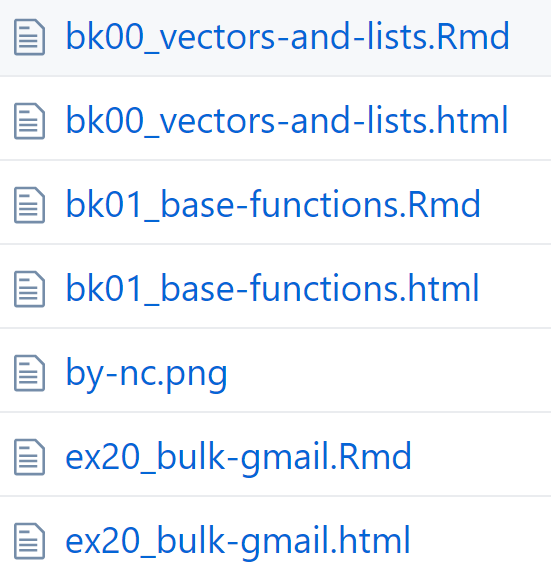

# About me

- Background: B.A./M.Sc. organismal biology/ecology
- Most recently in Santa Barbara, California
- Next up: Tel Aviv


---

background-image: url(img/santabarbara.jpg)
background-position: center
background-size: cover

---

background-image: url(https://media.giphy.com/media/wPn31WOCzkvKg/giphy.gif)
background-position: center
background-size: contain

---

# Advent of Code

A series of [programming puzzles](https://adventofcode.com/2017/about) in December every year (2015-present)

- language agnostic
- 2-part puzzles that build on a theme 
- leaderboard/stats

Fun topics (recursion, hashing, etc.) that are [do-able in R](https://isteves.github.io/advent_of_code_2017/index.html) but don't showcase the strengths of R/tidyverse

---

# Tidies of March

Bite-sized puzzles that focus on _core data science skills_ as championed by the tidyverse set of packages

**User goals:**

- Practice tidyverse skills
- Engage with the community
- Learn by reading other people's code
- Improve workflow/project management

---

# Lessons learned

- names matter
- paths are tricky
- time spent organizing code is time well spent

---

class: inverse, center, middle
# Naming things

---

#### Don't use 2 names for 1 thing

_Spot_ ran outside. I chased _the dog_.

#### Don't use 1 name for 2 things


---

## [How to name files](https://speakerdeck.com/jennybc/how-to-name-files)

Key principles from Jenny Bryan:

1. Machine readable
2. Human readable
3. Plays well with default ordering

---

[A real world example](https://github.com/jennybc/purrr-tutorial):


- _bk_ prefix to group topics in a chapter
- leading 0 to avoid _10, 1, 2, 3..._
- Underscore _ separates topic prefix from title
- Dash - separates words in title

---



---

## Good separators are context dependent

- **Folder/files:** use underscores/dashes 
    - `periods.have.special.meanings.EXT`
- **Functions:** snake_case ([tidyverse style guide](http://style.tidyverse.org/functions.html#naming))
    - `camelCaseIsHardToReadWhenThingsGetLong`
    - `dot.notation.has.special.meaning.in.S3`
- **Packages:** only letters, numbers, and periods
- **GitHub repositories:** best to match package name; dashes/underscores for script repos

---

class: inverse, center, middle
# Path tricks

---

#### Hard-coded paths won't work for anyone else:

`C:/Users/Irene/R/cute_puppies.jpg`

...but relative paths work differently in .R files versus in .Rmd's

---

#### `here::here()` makes relative paths easy

- .R finds files relative to .Rproj
- .Rmd finds files relative to wherever .Rmd lives

Paths won't "just work" when used in .R/.Rmd

```{r eval = FALSE}
df <- readr::read_csv("data/my_data.csv")
```

whereas `here::here` will make it work in both

```{r eval = FALSE}
df <- readr::read_csv(here::here("data/my_data.csv"))
```

---

#### Finding files within a package changes after installation

- Use `system.file(package = "pkgname")` to determine the file path to the installed package
- The `inst` directory in packages is "flattened" when installed

---

#### `fs` smooths out base R file path inconsistencies

```{r}
file.path("dir1\\dir2", "filename")
fs::path("dir1\\dir2", "filename")
```

Other reasons to try it:

- Consistent & predictable return values and names
- UTF-8
- Explicit failure

---

class: inverse, center, middle
# Project structure

---

> It is a truth universally acknowledged, that a single project in possession of many files, must be in want of a structure.

---

background-image: url(img/purrr-names-prefix.PNG)
background-position: center
background-size: contain

---

background-image: url(img/purrr-web.PNG)
background-position: center
background-size: contain

---

background-image: url(img/purrr-rmd.PNG)
background-position: center
background-size: cover

---

x

- checks file extensions
- parses yamls for titles and comments
- creates links
- adds `*` for bullets

---

# Tidyverse functions

What more is there than the core verbs?

- `mutate()`
- `select()`
- `filter()`
- `summarize()`
- `arrange()`
- `group_by()`

---

class: inverse, center, middle

# Under-loved tidyverse functions

---

## Data

```{r}
library(tidyverse)

starwars
```

---

background-image: url(img/grunions.jpg)
background-position: center
background-size: cover
class: inverse, center, middle

# `count`ing things

---

```{r}
starwars %>%
    group_by(hair_color, skin_color, eye_color) %>% #<<
    summarize(count = n()) #<<
```

---

```{r}
starwars %>% 
    count(hair_color, skin_color, eye_color) #<<
```

---

background-image: url(img/nest.jpg)
background-position: center
background-size: cover
class: inverse, center, middle

# Embrace the list-column

---

## List-columns in familiar form

```{r echo = FALSE}
sw <- starwars %>% 
    select(name, starships) %>% 
    unnest(starships) %>% 
    group_by(name) %>%
    summarize(starships_combined = paste(starships, collapse = "; "))
sw
```

---

## `separate` out the `rows`

```{r}
sw %>% 
    separate_rows(starships_combined, sep = "; ") #<<
```

---

## `nest()/unnest()`

```{r}
starwars %>% 
    select(name, starships) 
```

---

```{r}
starwars %>% 
    select(name, starships) %>% 
    unnest(starships) #<<
```

---

```{r}
starwars %>% 
    select(name, starships) %>% 
    unnest(starships) %>% 
    nest(name) #<<
```

---

## Typical use-cases

- models - split your data by some group and apply the model onto your tibble list-column
- strings - `str_extract_all` & friends often return results of varying length

---

background-image: url(img/shakshuka.jpg)
background-position: center
background-size: cover
class: inverse, center, middle

# Data ingest

---

## Handle data ingest issues upfront

```{r eval = FALSE}
read_csv("data.csv", 
         skip = 2,
         na = c("NA", "-9999"),
         trim_ws = TRUE)
```

---

```{r}
pies <- tribble(
    ~name, ~eggs, ~flour,
    "lemon", NA, NA, 
    " pumpkin", 2, 1,
    "chocolate ", 1, "none"
)

pies
```

---

```{r}
pies %>% 
    mutate(name = str_trim(name), #<<
           flour = na_if(flour, "none")) #<<
```

---

# `count()`

```{r}
starwars %>% 
    count(hair_color, skin_color, eye_color)
```

---


---

class: center, inverse

# Puzzle break 1

---

class: center, inverse

# Puzzle break 2

---

class: center, inverse

# Puzzle break 3

---

# Write functions

_even if you only use them once_

## Keep code **modular** and **readable**


