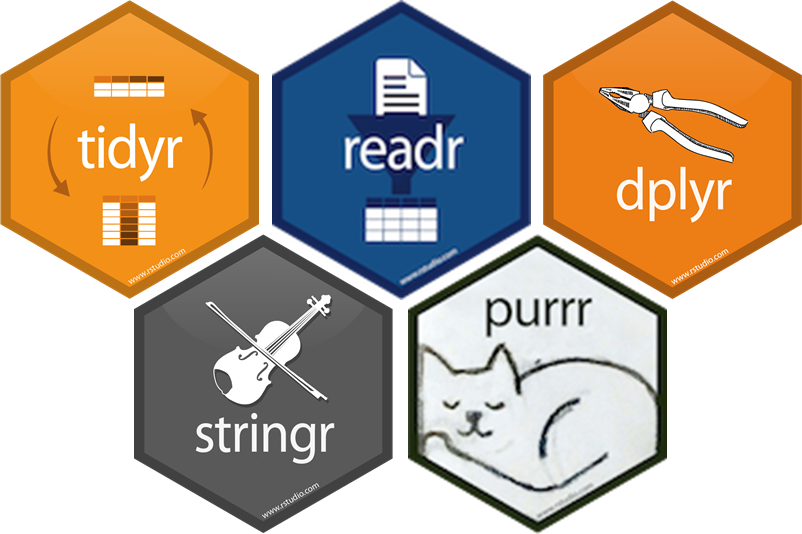
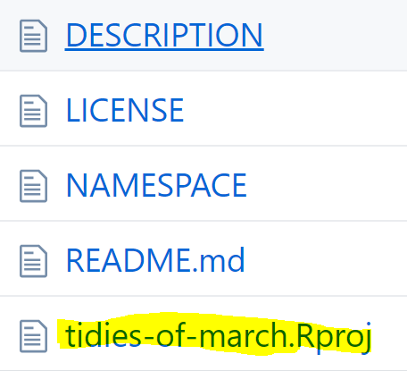
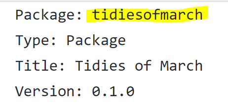
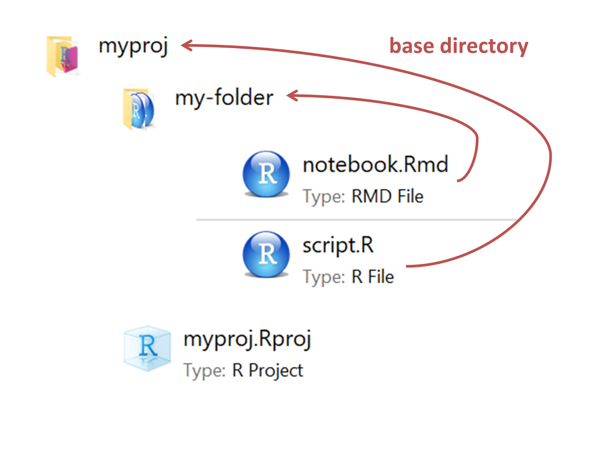
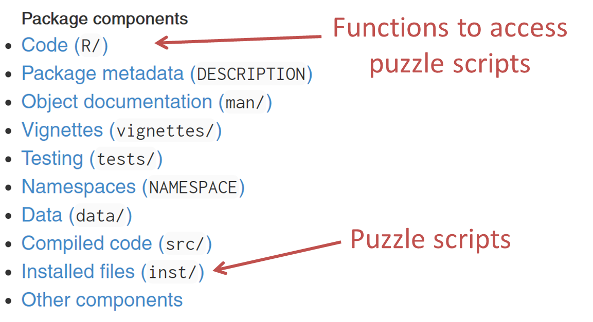

# About me

- Background: B.A./M.Sc. organismal biology/ecology
- Most recently in Santa Barbara, California
- Next up: Tel Aviv  


---

background-image: url(img/winter.gif)
background-position: center
background-size: cover

---

# Advent of Code

A series of [programming puzzles](https://adventofcode.com/2017/about) in December (2015-present)

- language agnostic
- 2-part puzzles that build on a theme 
- leaderboard/stats    

--

Fun topics (recursion, hashing, etc.) that are [possible to solve in R](https://isteves.github.io/advent_of_code_2017/index.html) but don't showcase the strengths of R/tidyverse

---

background-image: url(img/jenny.png)
background-position: center
background-size: contain

# Tidies of March

--

Bite-sized puzzles that focus on _core data science skills_ as championed by the tidyverse set of packages     



---

## User goals

- Practice data wrangling/tidyverse skills
- Engage with the community
- Learn by reading other people's code
- Improve workflow/project management

---

# My summer at RStudio

--

Created 30 puzzles with unique puzzle inputs and answer-checking

--

Prototyped two user interfaces:
- web-browser experience (language agnostic)
- R-mediated experience

---

class: inverse, center, middle
# Demo

---

# Internship take-aways

--

.xlarge[Names matter]

--

.xlarge[Links are tricky]

--

.xlarge[Time spent organizing is time well spent]

---

class: inverse, center, middle
# Names

---

class: center, middle
## Don't use 2 names for 1 thing

---

class: center

.large[
.pull-left[puzzle]
.pull-right[challenge]
]
<br>

```{r echo = FALSE, out.width = "120%"}
library(tidyverse)

```

---

.center[`tidies-of-march`]

valid RProj/GitHub repo name, _invalid_ R package name

.pull-left[

]

.pull-right[

]

---

From Jenny Bryan, _[How to name files](https://speakerdeck.com/jennybc/how-to-name-files)_:

.xlarge[
1. Machine readable
2. Human readable
3. Plays well with default ordering
]

---

[A real world example](https://github.com/jennybc/purrr-tutorial):


- _bk_ prefix to group topics in a chapter
- leading 0 to avoid _10, 1, 2, 3..._
- Underscore _ separates topic prefix from title
- Dash - separates words in title

---

class: inverse, center, middle
# Linking things

---

## Use relative paths

Hard-coded paths won't work for other people

.center[`C:/Users/Irene/cute_puppy.jpg`]

.pull-left[]
.pull-right[]

---

...but relative paths work differently in .R files versus in .Rmd's



---

class: center, middle

.xlarge[`here::here`] 
eliminates the issue

```{r eval = FALSE}
read_csv(here::here("data/my_data.csv"))
```

---

## Paths after package installation

- `here::here` no longer looks in the same place

--

- `inst` directory gets "flattened" when installed

--

- Use `system.file("myfile.EXT", package = "pkgname")` for paths in an installed package

---

## `fs`

smooths out base R file path inconsistencies

```{r}
file.path("dir1\\dir2", "filename")
```

--

```{r}
fs::path("dir1\\dir2", "filename")
```

---

## `fs`

- Return values and names are consistent & predictable
- Vectorized
- UTF-8
- Explicit failure

---

class: inverse, center, middle
# Project organization

---

class: middle

.xlarge[
_Be predictable:_   

follow conventions unless you have a good reason not to
]

---

## Packages give functions structure



--

Fitting into a familiar structure awkwardly is often better than inventing something brand new

---

class: middle

.xlarge[
Systematic names & directory structure --> easy to work with files programmatically
]

---

background-image: url(img/purrr-web.PNG)
background-position: center
background-size: contain

---

background-image: url(img/purrr-names-prefix.PNG)
background-position: center
background-size: contain

---

## [index.Rmd](https://github.com/jennybc/purrr-tutorial/blob/gh-pages/index.Rmd)

Pre-process all files once

- filter for files with both .Rmd and .html
- extract titles and comments from ymls
- add formatting (`*` for bullets, italics for comments, links to html)

--

For each _section_, filter for the relevant files

---

background-image: url(img/purrr-rmd.PNG)
background-position: center
background-size: cover

---

class: inverse, center, middle

# Puzzle 1

---

# Function highlights

- `readr::read_csv`
- `tidyr::separate_rows`

_[script](https://github.com/isteves/paris/blob/master/scripts/ex_encoding-seprows.R)_

---

class: inverse, center, middle

# Puzzle 2

---

# Function highlights

- `lubridate::ymd`
- `purrr::map2`
- `tidyr::unnest`
- `dplyr::top_n`

_[script](https://github.com/isteves/paris/blob/master/scripts/ex_periods.R)_

---

background-image: url(img/santabarbara2.png)
background-position: center
background-size: cover
class: center, middle

# Thank you!

<i class="fab fa-twitter"></i> [i_steves](https://twitter.com/i_steves) `r icon::fa("github")` [isteves](https://github.com/isteves)
